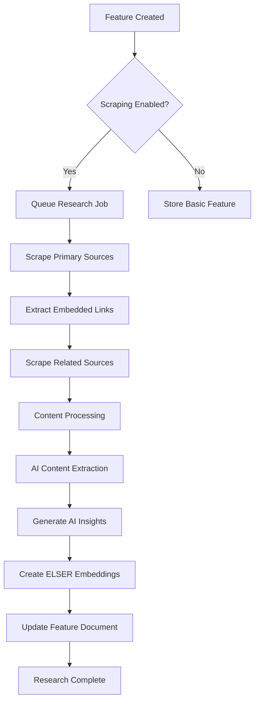

# Content Research Architecture

## Overview

The Content Research system automatically enriches basic feature metadata with comprehensive documentation, code examples, and contextual information scraped from web sources. This enriched content enables the generation of detailed, accurate presentations and hands-on labs.

## Content Research Workflow

### 1. Trigger Points

**Automatic Triggers:**
- New feature creation (when `scrape-docs` checkbox is enabled)
- Scheduled refresh of existing features (configurable interval)
- API endpoint `/features/{id}/research` called explicitly

**Manual Triggers:**
- Web UI "Refresh Content" button
- Admin interface for bulk content updates
- CLI command for research management

### 2. Research Pipeline



### 3. Primary Source Processing

**Source Validation:**
```python
async def validate_source(url: str) -> bool:
    """Validate if URL should be scraped"""
    # Check allowed domains (elastic.co, github.com/elastic, etc.)
    # Verify URL is accessible
    # Check for rate limiting
    # Validate content type (HTML, Markdown)
    return is_valid
```

**Content Scraping:**
```python
async def scrape_primary_source(url: str) -> SourceContent:
    """Scrape content from primary documentation source"""
    # Fetch HTML content with proper headers
    # Extract main content (remove navigation, ads, etc.)
    # Parse code examples and preserve formatting
    # Extract page metadata (title, sections, etc.)
    # Find embedded links for related source discovery
    return SourceContent(...)
```

**Content Structure:**
- **Raw HTML**: Original scraped content
- **Cleaned Text**: Processed text with markup removed
- **Code Examples**: Extracted and formatted code blocks
- **Metadata**: Page structure, sections, modification dates
- **Links**: Embedded URLs for related source discovery

### 4. Related Source Discovery

**Link Following Strategy:**
1. **Extract Links**: Parse all URLs from primary source content
2. **Filter Relevant**: Apply domain whitelist and relevance scoring
3. **Depth Control**: Limit following to prevent infinite recursion
4. **Rate Limiting**: Respect robots.txt and implement delays

**Relevance Scoring:**
```python
def calculate_relevance_score(link: str, context: str, feature: Feature) -> float:
    """Calculate relevance score for discovered link"""
    score = 0.0

    # Domain authority (elastic.co gets higher score)
    score += domain_authority_score(link)

    # Content type (documentation > blog > forum)
    score += content_type_score(link)

    # Context relevance (surrounding text analysis)
    score += context_relevance_score(context, feature.name)

    # Feature domain alignment
    score += domain_alignment_score(link, feature.domain)

    return min(score, 1.0)
```

**Discovery Sources:**
- **Documentation Links**: Related pages in official docs
- **Blog Posts**: Relevant articles from elastic.co/blog
- **GitHub Repositories**: Code examples and implementations
- **Community Content**: Discuss forums, Stack Overflow (lower priority)

### 5. Content Processing Pipeline

**Text Extraction:**
```python
async def extract_content(html: str) -> ProcessedContent:
    """Extract and clean content from HTML"""
    # Remove navigation, ads, footer content
    # Preserve code blocks with syntax highlighting
    # Extract headings and maintain document structure
    # Handle images and diagrams (alt text)
    # Normalize whitespace and formatting
    return ProcessedContent(...)
```

**Code Example Processing:**
```python
def extract_code_examples(content: str) -> List[CodeExample]:
    """Extract and structure code examples"""
    examples = []
    # Find code blocks (```json, ```bash, etc.)
    # Extract language and formatting
    # Add context from surrounding text
    # Validate syntax where possible
    return examples
```

### 6. AI Content Extraction

**Key Concept Identification:**
```python
async def extract_key_concepts(content: str, feature: Feature) -> List[str]:
    """Use AI to identify key technical concepts"""
    prompt = f"""
    Analyze this technical documentation for {feature.name} and extract the key concepts.
    Focus on:
    - Technical terms and technologies
    - Configuration parameters
    - API endpoints and methods
    - Related Elasticsearch features

    Content: {content[:4000]}
    """

    concepts = await ai_client.extract_concepts(prompt)
    return validate_and_filter_concepts(concepts)
```

**Use Case Generation:**
```python
async def generate_use_cases(content: str, feature: Feature) -> List[UseCase]:
    """Generate practical use cases from documentation"""
    prompt = f"""
    Based on this documentation for {feature.name}, generate 3-5 practical use cases.
    Each use case should include:
    - Title and description
    - Complexity level (beginner/intermediate/advanced)
    - Estimated implementation time
    - Required prerequisites

    Content: {content[:4000]}
    """

    use_cases = await ai_client.generate_use_cases(prompt)
    return structure_use_cases(use_cases)
```

### 7. AI Insights Generation

**Technical Summary:**
```python
async def generate_technical_summary(feature: Feature, content: str) -> str:
    """Generate concise technical summary"""
    prompt = f"""
    Create a technical summary for {feature.name} in 2-3 sentences.
    Focus on:
    - What it does technically
    - Key implementation details
    - Performance or architectural benefits

    Documentation content: {content[:3000]}
    """
    return await ai_client.summarize(prompt)
```

**Business Value Analysis:**
```python
async def generate_business_value(feature: Feature, content: str) -> str:
    """Generate business value proposition"""
    prompt = f"""
    Analyze the business value of {feature.name} based on this documentation.
    Focus on:
    - Cost reduction opportunities
    - Efficiency improvements
    - User experience benefits
    - Competitive advantages

    Content: {content[:3000]}
    """
    return await ai_client.analyze_business_value(prompt)
```

**Presentation Angle Suggestions:**
```python
async def suggest_presentation_angles(feature: Feature, insights: dict) -> List[PresentationAngle]:
    """Suggest different ways to present this feature"""
    angles = []

    # Technical audience angle
    if insights.get('technical_complexity') == 'high':
        angles.append(PresentationAngle(
            angle="Deep Technical Dive",
            description="Focus on implementation details and architecture",
            target_audience="technical",
            estimated_slides=8
        ))

    # Business audience angle
    if insights.get('business_impact') == 'high':
        angles.append(PresentationAngle(
            angle="Business Value Focus",
            description="Emphasize ROI and business outcomes",
            target_audience="business",
            estimated_slides=5
        ))

    return angles
```

### 8. ELSER Embedding Generation

**Text Preparation:**
```python
def prepare_embedding_text(feature: Feature, content_research: ContentResearch) -> Dict[str, str]:
    """Prepare optimized text for ELSER embedding"""

    # Feature summary embedding text
    feature_summary = f"""
    {feature.name} - {feature.description}
    Benefits: {', '.join(feature.benefits)}
    Business value: {content_research.ai_insights.business_value}
    Target audience: {', '.join(content_research.ai_insights.recommended_audience)}
    """

    # Technical content embedding text
    technical_content = f"""
    Key concepts: {', '.join(content_research.extracted_content.key_concepts)}
    Use cases: {'; '.join([uc.title for uc in content_research.extracted_content.use_cases])}
    Prerequisites: {', '.join(content_research.extracted_content.prerequisites)}
    Configuration examples: {get_code_snippets(content_research)}
    """

    # Full documentation embedding (truncated to model limits)
    full_documentation = combine_all_content(content_research, max_tokens=8000)

    return {
        "feature_summary": feature_summary,
        "technical_content": technical_content,
        "full_documentation": full_documentation
    }
```

**Embedding Generation:**
```python
async def generate_elser_embeddings(texts: Dict[str, str]) -> Dict[str, ELSERembedding]:
    """Generate ELSER embeddings for prepared texts"""
    embeddings = {}

    for field_name, text in texts.items():
        try:
            response = await elasticsearch_client.ml.infer_trained_model(
                model_id=".elser_model_2",
                docs=[{"text_field": text}]
            )

            embeddings[field_name] = ELSERembedding(
                text=text,
                elser_embedding=response["inference_results"][0]["predicted_value"],
                generated_at=datetime.utcnow(),
                model_version=".elser_model_2"
            )
        except Exception as e:
            logger.error(f"Failed to generate embedding for {field_name}: {e}")

    return embeddings
```

## Error Handling and Resilience

### Scraping Failures
```python
class ContentResearchError(Exception):
    """Base exception for content research failures"""
    pass

class ScrapingTimeoutError(ContentResearchError):
    """Raised when scraping times out"""
    pass

class AccessDeniedError(ContentResearchError):
    """Raised when access to URL is denied"""
    pass

async def robust_scraping(url: str, max_retries: int = 3) -> Optional[str]:
    """Scrape with retry logic and error handling"""
    for attempt in range(max_retries):
        try:
            return await scrape_url(url, timeout=30)
        except ScrapingTimeoutError:
            if attempt < max_retries - 1:
                await asyncio.sleep(2 ** attempt)  # Exponential backoff
                continue
            raise
        except AccessDeniedError:
            logger.warning(f"Access denied for {url}, skipping")
            return None
    return None
```

### Partial Failure Handling
- **Graceful Degradation**: Continue processing even if some sources fail
- **Status Tracking**: Mark specific source failures in document status
- **Retry Logic**: Implement exponential backoff for transient failures
- **Manual Recovery**: Provide admin interface to retry failed sources

### Rate Limiting
```python
class RateLimiter:
    """Implement respectful scraping with rate limits"""

    def __init__(self, requests_per_second: float = 2.0):
        self.min_interval = 1.0 / requests_per_second
        self.last_request = {}

    async def wait_if_needed(self, domain: str):
        """Wait if necessary to respect rate limits"""
        now = time.time()
        if domain in self.last_request:
            elapsed = now - self.last_request[domain]
            if elapsed < self.min_interval:
                await asyncio.sleep(self.min_interval - elapsed)
        self.last_request[domain] = time.time()
```

## Configuration and Customization

### Research Configuration
```python
@dataclass
class ResearchConfig:
    """Configuration for content research behavior"""

    # Scraping settings
    enabled: bool = True
    max_sources_per_feature: int = 10
    max_follow_depth: int = 2
    timeout_seconds: int = 30
    rate_limit_per_domain: float = 2.0  # requests per second

    # Content processing
    max_content_length: int = 50000
    extract_code_examples: bool = True
    follow_external_links: bool = False

    # AI processing
    ai_insights_enabled: bool = True
    generate_embeddings: bool = True
    embedding_model: str = ".elser_model_2"

    # Allowed domains
    allowed_domains: List[str] = [
        "elastic.co",
        "github.com/elastic",
        "discuss.elastic.co"
    ]
```

### Domain-Specific Rules
```python
DOMAIN_RULES = {
    "elastic.co": {
        "priority": 1.0,
        "rate_limit": 2.0,
        "content_selectors": [".content", ".main", "#main-content"],
        "exclude_selectors": [".navigation", ".footer", ".sidebar"]
    },
    "github.com": {
        "priority": 0.8,
        "rate_limit": 1.0,
        "content_selectors": [".readme", ".md-content"],
        "file_types": [".md", ".rst", ".txt"]
    }
}
```

## Monitoring and Observability

### Research Metrics
- **Success Rate**: Percentage of successful content research operations
- **Source Availability**: Tracking which sources are consistently accessible
- **Processing Time**: Average time for complete research pipeline
- **Content Quality**: Metrics on extracted content richness
- **Embedding Performance**: ELSER embedding generation success rates

### Logging and Tracing
```python
@trace_async("content_research")
async def research_feature_content(feature_id: str) -> ContentResearch:
    """Main research pipeline with full observability"""

    with tracer.start_span("validate_sources") as span:
        valid_sources = await validate_documentation_links(feature.documentation_links)
        span.set_attribute("source_count", len(valid_sources))

    with tracer.start_span("scrape_primary_sources") as span:
        primary_content = await scrape_sources(valid_sources)
        span.set_attribute("scraped_count", len(primary_content))

    # Continue with full tracing...
```

### Health Checks
```python
async def research_health_check() -> HealthStatus:
    """Check health of content research system"""
    checks = {
        "elasticsearch_connection": await check_elasticsearch(),
        "elser_model_available": await check_elser_model(),
        "scraping_service": await check_scraping_capability(),
        "ai_service": await check_ai_service()
    }

    return HealthStatus(
        healthy=all(checks.values()),
        details=checks,
        timestamp=datetime.utcnow()
    )
```

This content research architecture provides the foundation for automatically enriching features with comprehensive, accurate, and semantically searchable content that enables the generation of high-quality presentations and labs.